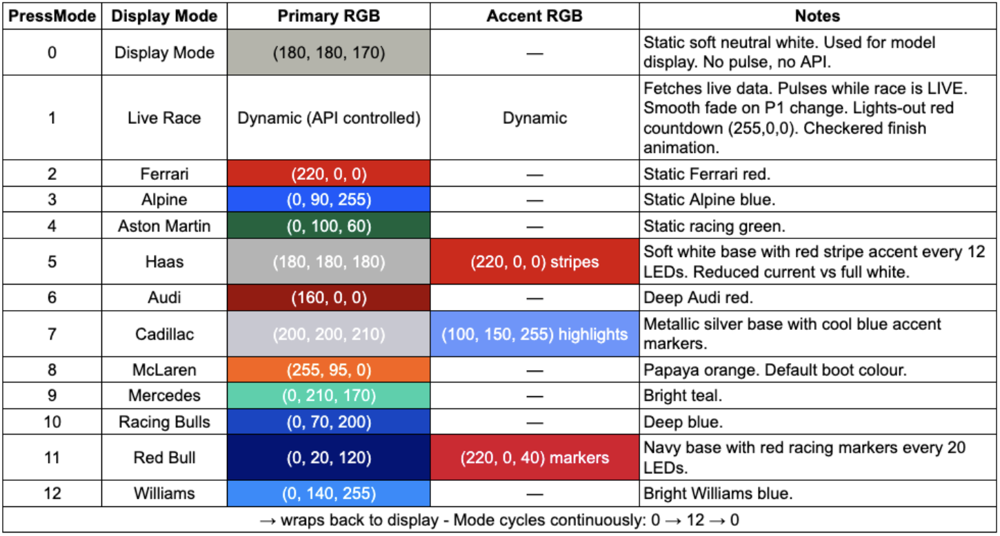

# F1 Live Leader NeoPixel Display

## Overview

This project is an IoT-based ambient display system built using a **NodeMCU (ESP8266)** and a **1-meter WS2812B NeoPixel LED strip**.

The system fetches live Formula 1 race results from the Jolpica (Ergast - compatible) API and dynamically renders LED team colors to represent the leading constructor during a race.

At race completion, a checkered flag animation is triggered, and the winning constructor's color is stored in EEPROM so that the display persists until the next race.

The project is fully standalone and does not require a backend server.

---

## Features

- Fetches live race results from Ergast F1 API
- Displays leading constructor color during race
- Smooth fade transitions between teams
- Subtle pulse animation while race is live
- Checkered flag wipe animation on race completion
- Winner color persists using EEPROM
- Automatic brightness adjustment based on time of day (IST)
- Default boot state set to McLaren if EEPROM is uninitialized
- Race weekend detection (no false triggers)
- Physical button toggle for display mode
- LED-optimised team colours

## Display Mode

A hardware push-button toggles between:

- Live Race Mode (default)
- Display Mode (neutral white illumination)

Returning to Live Mode resumes race state immediately.

## Team Color Reference

| Team | Primary Color | 
|------|---------------|
| Ferrari |  |
| Alpine |  | 
| Aston Martin |  | 
| Haas |  | 
| Audi |  | 
| Cadillac |  | 
| McLaren |  | 
| Mercedes |  | 
| Racing Bulls |  | 
| Red Bull Racing |  | 
| Williams |  | 

## Team Color Reference (LED-Optimized)

The following colors are tuned for emissive LED display rather than print-accurate brand hex values.  
Dark brand colors have been adjusted to improve real-world visibility on WS2812B LEDs.

| Team | LED Color | RGB Value | Notes |
|------|-----------|-----------|-------|
| Ferrari |  | (220, 20, 20) | Strong saturated red |
| Alpine |  | (20, 40, 150) | Boosted deep blue |
| Aston Martin |  | (0, 130, 90) | Brighter emerald tone |
| Haas |  | (220, 0, 45) | Red accent instead of black |
| Audi |  | (180, 0, 0) | Highlight red for visibility |
| Cadillac |  | (180, 180, 180) | Soft silver |
| McLaren |  | (255, 120, 0) | Warm papaya orange |
| Mercedes |  | (0, 255, 210) | Bright teal |
| Racing Bulls |  | (40, 60, 200) | Enhanced navy |
| Red Bull Racing |  | (10, 60, 200) | Deep visible blue |
| Williams |  | (20, 40, 180) | Rich royal blue |
---

## Hardware Requirements

- NodeMCU (ESP8266)
- 1m WS2812B LED strip (60 LEDs recommended)
- External 5V power supply (minimum 4A recommended)
- 330Ω resistor (data line protection)
- 1000µF capacitor across 5V and GND (recommended)
- Jumper wires
- Push button (GPIO D3 to GND)

---

## Wiring

| NodeMCU Pin | LED Strip |
|-------------|-----------|
| D4 (GPIO2)  | DIN (via 330Ω resistor) |
| GND         | GND |
| External 5V | 5V |

**Important:**
- The external power supply GND must be connected to NodeMCU GND.
- Do not power the LED strip directly from the NodeMCU 5V pin.
## Power Considerations

A 60-LED strip may draw up to 3.6A at full brightness.  
Use an external 5V supply.  
Common ground between NodeMCU and LED strip is mandatory.

---

## Software Requirements

Install in Arduino IDE:

- ESP8266 Board Package
- ESP8266WiFi
- ESP8266HTTPClient
- ArduinoJson
- Adafruit NeoPixel
- EEPROM (built-in)

---
## System Architecture

The system operates as a standalone embedded IoT device.

WiFi

│

▼

Jolpica F1 API

(Race Results + Next Race)

│

▼

NodeMCU (ESP8266)

│

├── JSON Parsing (ArduinoJson)

├── Race State Logic

├── EEPROM Persistence

├── Time Sync (NTP)

│

▼

WS2812B LED Strip (1m)

### Data Flow

1. Device connects to WiFi.
2. Syncs time using NTP.
3. Checks if today is a race day.
4. If race weekend:
   - Polls API every 2 minutes.
   - Detects leading constructor.
   - Updates LED strip.
5. If race finished:
   - Runs checkered animation.
   - Stores winner in EEPROM.
6. Button toggles between Live Mode and Display Mode.

## Wiring Diagram

### LED Strip Connections

| NodeMCU Pin | LED Strip |
|-------------|-----------|
| D4 (GPIO2)  | DIN (via 330Ω resistor) |
| GND         | GND |
| External 5V | 5V |

Important:
- Use a 1000µF capacitor across 5V and GND at the LED strip (in parallel)
- For maximum effectiveness, the capacitor should be placed:
        -As close as possible to the input connectors of the LED strip, and across the power rails, specifically connecting the positive terminal to the 5V+ line and the negative terminal to the Ground line.
This placement helps neutralize "ringing" or voltage spikes that can travel down long power lines before they reach the sensitive electronics inside the pixels.
- The external 5V supply must share ground with the NodeMCU.
-  Don't power the NodeMCU through VIN from the same 5V supply. VIN goes through the onboard voltage regulator and can cause instability with a high-current LED strip on the same rail. Power the NodeMCU separately via USB only. The 5V from PSU should go directly to the LED strip and capacitor only — not touch the NodeMCU at all.

---

### Button Connection

| Button Pin | Connection |
|------------|------------|
| One side   | D3 (GPIO0) |
| Other side | GND |

Button uses internal pull-up resistor.
Pressing the button pulls the pin LOW.

## API Used

https://github.com/jolpica/jolpica-f1
(alternative to the now deprecated Ergast Developer API (free, no API key required, Ergast fork))
hit GET request https://api.jolpi.ca/ergast/f1/current/last/results.json on postman

## API Endpoints Used

Race Results:
https://api.jolpi.ca/ergast/f1/current/last/results.json

Next Race Detection:
https://api.jolpi.ca/ergast/f1/current/next.json

## Demo

Live Mode:
- Pulsing team colour during race
- Smooth transitions on leader change
- Checkered wipe on finish

Display Mode:
- Neutral white illumination for model showcase

#Edit - additional functionality

Button cycle order (13 modes, wraps back to 0):

| PressMode  | Display |
|-------------|-----------|
| 0  | (warm white) |
| 1  | Live race |
| 2  | Ferrari|
| 3  | Alpine|
| 4  | Aston Martin |
| 5  | Haas  |
| 6  | Audi  |
| 7  | Cadillac |
| 8  | McLaren |
| 9  | Mercedes |
| 10 | Racing Bulls |
| 11 | Red Bull|
| 12 | Williams | 
→ wraps to 0Display again 

Other changes:

- Mode saved to EEPROM slot 1 (slot 0 still holds last winner team) — survives power cuts
- Debounce moved into button logic properly using millis() instead of delay()
- smoothFadeToColor() extracted as a reusable function so display white also fades in smoothly
- API polling and pulse only run when actually in MODE_LIVE — team color modes are fully static, no unnecessary network calls

